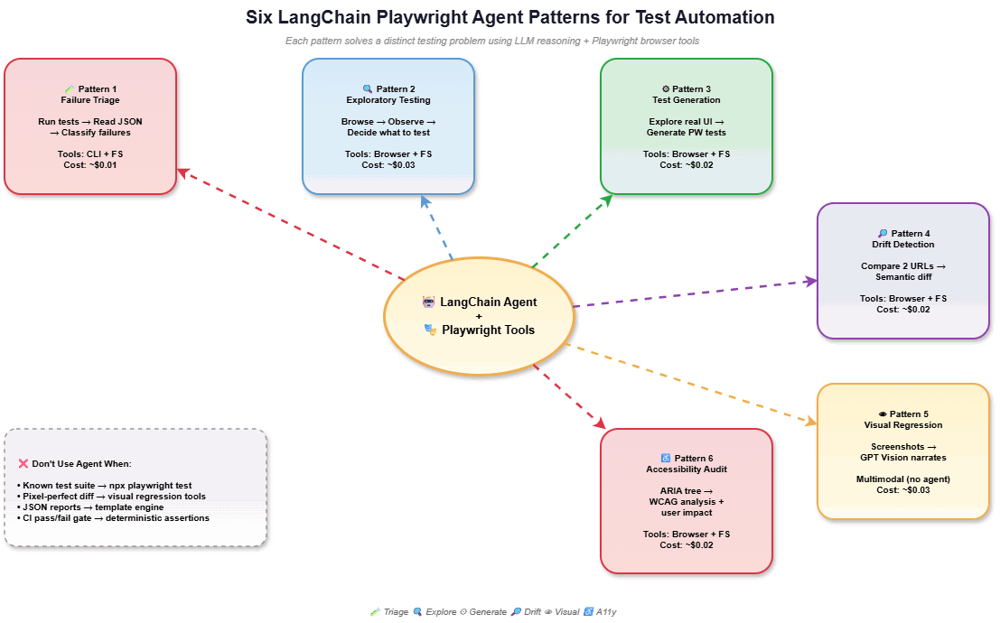
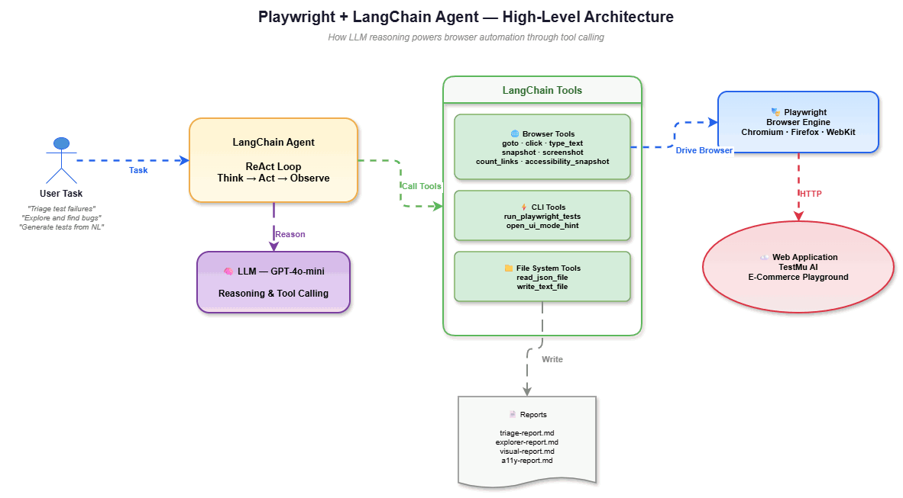
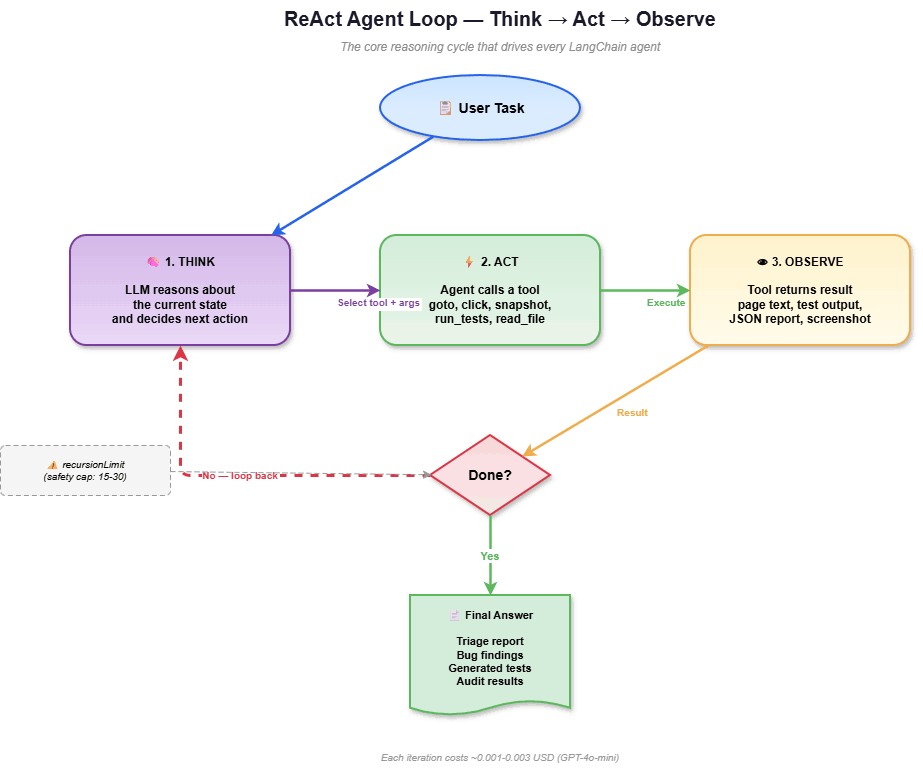
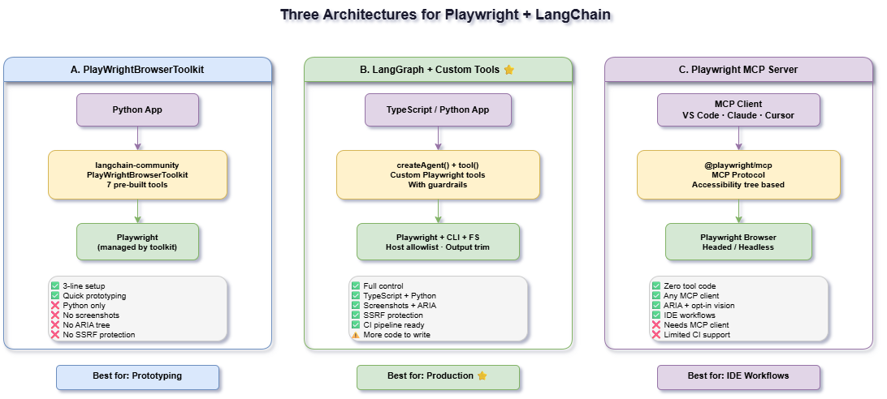
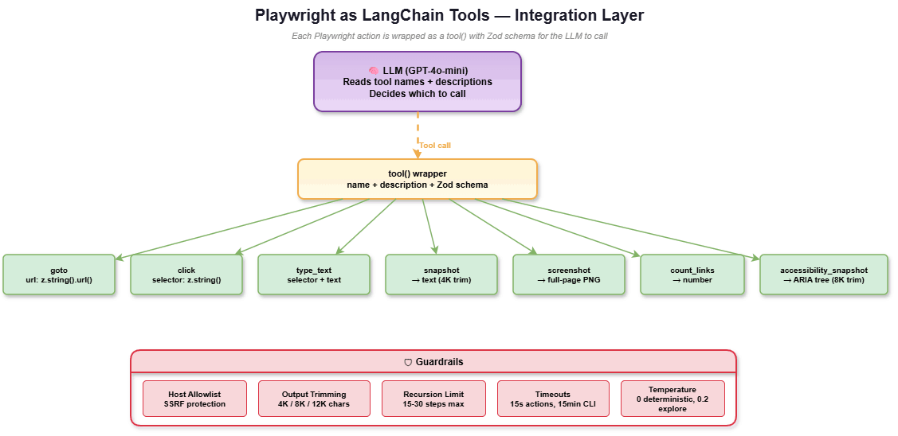
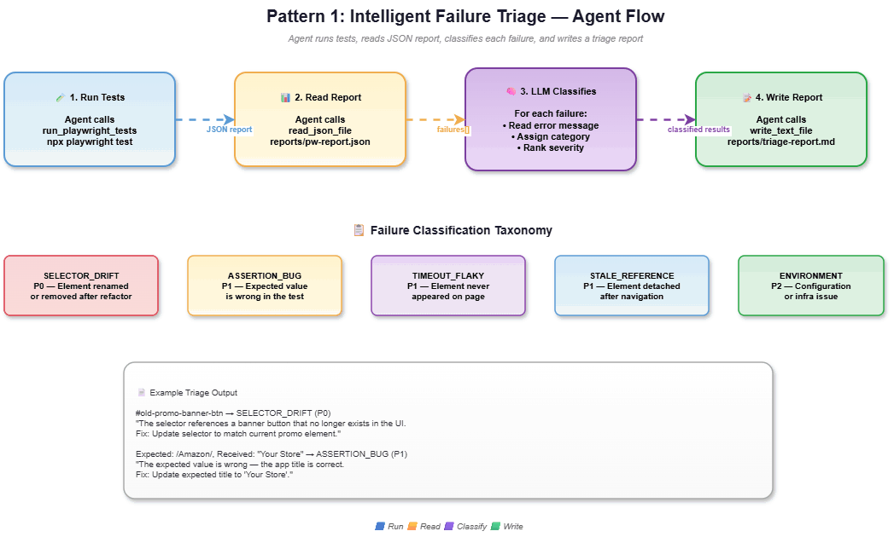
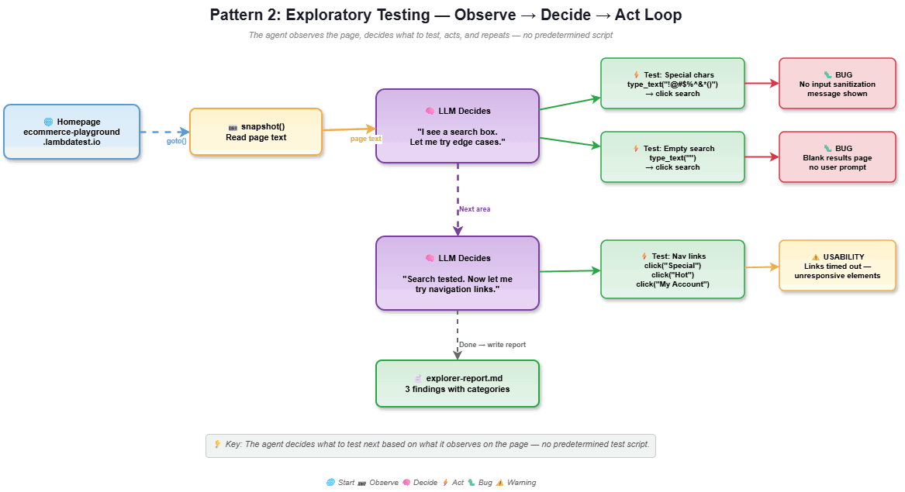
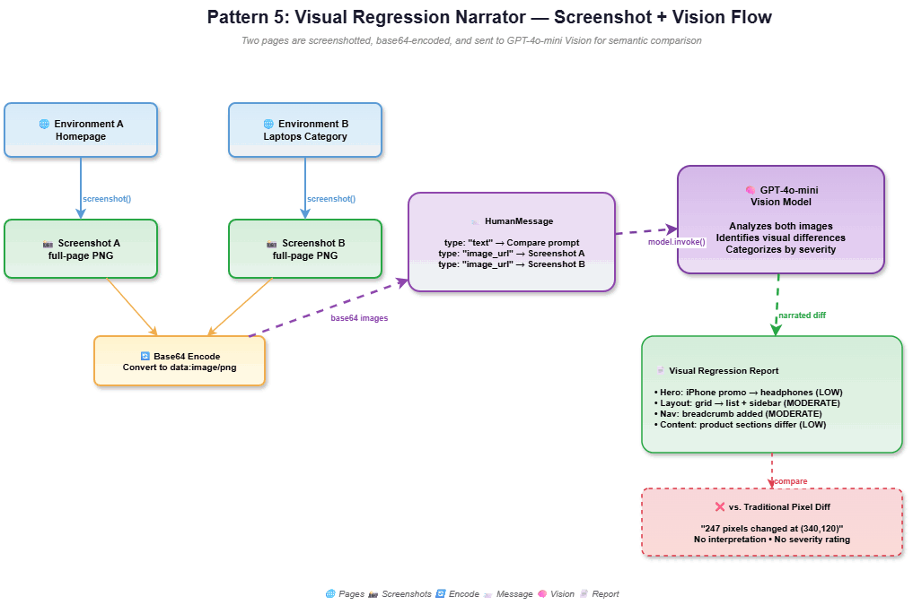

# Playwright + LangChain Agents


> This repo is the companion code for **[How to Integrate Playwright with LangChain Agents?](https://www.testmuai.com/learning-hub/author/rakesh-vardhan/)** on the TestMu AI Blog. The blog covers architecture choices, setup, all six patterns with real output, common errors, and when (not) to use agents.

LLM-powered test automation agents that combine Playwright's browser control with LangChain's reasoning capabilities. Instead of replacing test scripts, these agents handle tasks that need interpretation — triaging failures, exploring pages, generating tests from plain English, and auditing accessibility.



## How It Works

Playwright handles browser execution (clicks, navigation, screenshots, ARIA snapshots). LangChain wraps those operations as callable tools with host allowlists, output trimming, and Zod schemas. A ReAct agent loops through **think → call a tool → observe → decide next step** until the task is complete.



The LLM never touches the browser directly — it calls well-defined tools with validated inputs. This separation keeps things safe and predictable.



## Architecture

This project uses the **LangGraph + Custom Tools** approach — custom Playwright tools wired into a LangGraph-based ReAct agent via `createAgent()`. This gives full control over tool behavior (host allowlists, output trimming, screenshots, ARIA snapshots) compared to the pre-packaged `PlayWrightBrowserToolkit` or the Playwright MCP server.



### Tool Integration

Seven browser tools (`goto`, `click`, `type_text`, `snapshot`, `count_links`, `screenshot`, `accessibility_snapshot`), plus CLI tools to run the Playwright test suite and file I/O tools to read reports and write outputs.



Key design decisions:
- **Host allowlist on `goto`** — prevents SSRF by restricting navigation to approved domains
- **Output trimming** — page snapshots: 4K chars, ARIA tree: 8K, test output: 8K, JSON reports: 12K
- **Zod schemas** — typed parameters so the LLM knows what each tool accepts

## Six Agent Patterns

### Pattern 1: Intelligent Failure Triage

Runs the Playwright test suite, reads the JSON report, and classifies each failure into root-cause categories (`SELECTOR_DRIFT`, `ASSERTION_BUG`, `TIMEOUT_FLAKY`, `STALE_REFERENCE`) with severity ratings and suggested fixes.



### Pattern 2: Exploratory Testing

Autonomously navigates and interacts with a site, deciding what to test next based on page snapshots. Finds bugs, usability issues, and edge cases without a predetermined script.



### Pattern 3: Test Generation

Takes a natural-language description of user flows, explores the real application to discover actual DOM selectors, and generates Playwright test code from what it observes.

### Pattern 4: Cross-Environment Drift Detection

Visits two URLs, snapshots each, and semantically compares them — distinguishing meaningful regressions from expected differences (like different page titles or link counts).

### Pattern 5: Visual Regression Narrator

Captures full-page screenshots of two environments and sends them to a vision-capable LLM, which describes visual differences in plain English instead of pixel coordinates.



### Pattern 6: Accessibility Audit

Reads the ARIA tree via `ariaSnapshot()` and explains WCAG violations in terms of user impact — who is affected and how — rather than just listing rule IDs.

## Project Structure

```
├── tests/
│   ├── smoke.spec.ts             # Passing smoke tests
│   ├── failing.spec.ts           # Intentionally failing tests (4 patterns)
│   └── generated.spec.ts         # AI-generated tests (agent output)
├── agent/
│   ├── package.json              # ESM, LangChain dependencies
│   ├── tsconfig.json             # ES2022, NodeNext
│   ├── .env                      # OPENAI_API_KEY
│   └── src/
│       ├── tools/
│       │   ├── playwright-tools.ts  # 7 browser control tools
│       │   ├── cli-tools.ts         # Test runner tools
│       │   └── fs-tools.ts          # File I/O tools
│       ├── triage-agent.ts       # Pattern 1
│       ├── explorer-agent.ts     # Pattern 2
│       ├── testgen-agent.ts      # Pattern 3
│       ├── drift-agent.ts        # Pattern 4
│       ├── visual-agent.ts       # Pattern 5
│       └── a11y-agent.ts         # Pattern 6
├── diagrams/                     # Architecture and flow diagrams
├── reports/                      # Agent-generated outputs (git-ignored)
└── playwright.config.ts          # JSON + HTML + list reporters
```

## Prerequisites

- Node.js 22+
- An OpenAI API key (or any LangChain-supported LLM provider)

## Setup

```bash
# Clone and install
git clone https://github.com/rakesh-vardan/pw-lang-agents.git
cd pw-lang-agents
npm install
npx playwright install

# Install agent dependencies
cd agent
npm install

# Add your API key
echo "OPENAI_API_KEY=sk-..." > .env
```

## Running Agents

All agent commands run from the `agent/` directory:

```bash
npm run agent:triage    # Classify test failures by root cause
npm run agent:explore   # Autonomously explore a site and find bugs
npm run agent:testgen   # Generate Playwright tests from natural language
npm run agent:drift     # Compare two URLs for semantic differences
npm run agent:visual    # Screenshot-based visual regression with GPT vision
npm run agent:a11y      # Accessibility audit using ARIA tree analysis
```

Each agent writes its output to the `reports/` directory.

## Running Tests

```bash
# From the project root
npx playwright test                       # Run all tests
npx playwright test tests/smoke.spec.ts   # Run smoke tests only
npx playwright test tests/failing.spec.ts # Run intentionally failing tests
```

## Target Application

All agents and tests run against the [TestMu AI E-Commerce Playground](https://ecommerce-playground.lambdatest.io/).

## Tech Stack

| Component | Version | Purpose |
|-----------|---------|---------|
| Playwright | 1.58+ | Browser automation, test runner, ARIA snapshots |
| LangChain.js | 1.x | `createAgent`, `tool`, ReAct agent framework |
| @langchain/openai | 1.x | `ChatOpenAI` LLM connection |
| @langchain/langgraph | 1.x | Graph-based agent execution |
| OpenAI GPT-4o-mini | — | LLM for reasoning and vision |
| TypeScript | 5.9+ | All agent code (ESM) |
| Zod | 4.x | Tool parameter schemas |

## Cost

With `gpt-4o-mini`, each agent run costs roughly:

| Pattern | Cost |
|---------|------|
| Triage | ~$0.01 |
| Explorer | ~$0.03 |
| Test Generation | ~$0.02 |
| Drift Detection | ~$0.02 |
| Visual Regression | ~$0.03 |
| Accessibility Audit | ~$0.02 |

